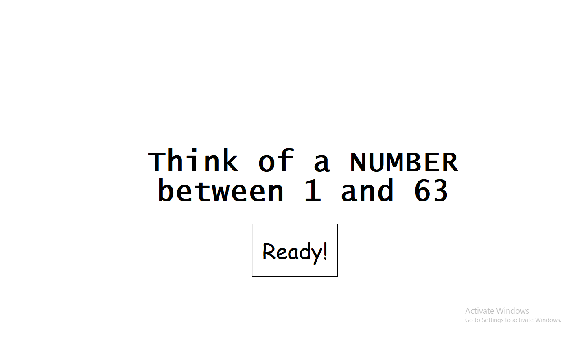
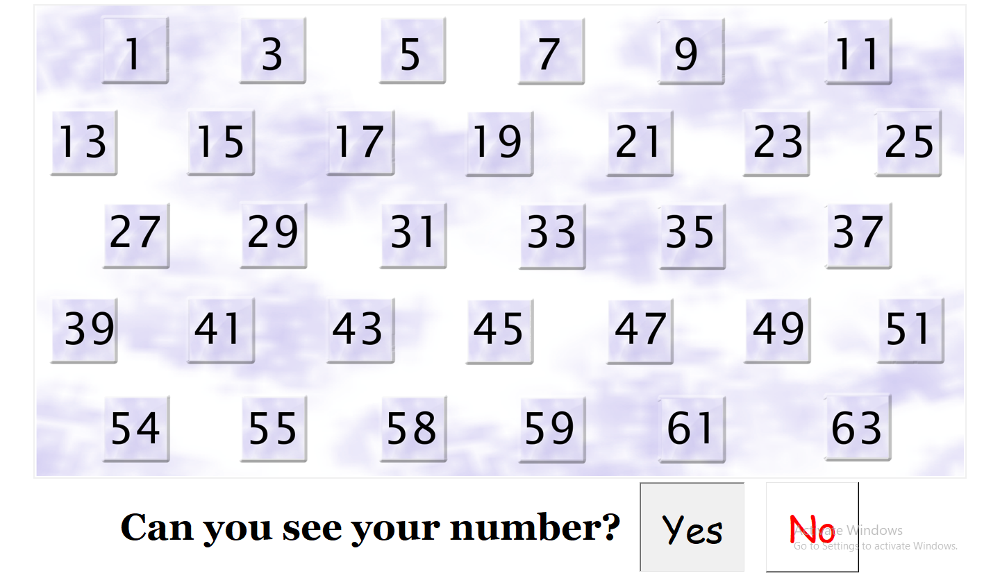
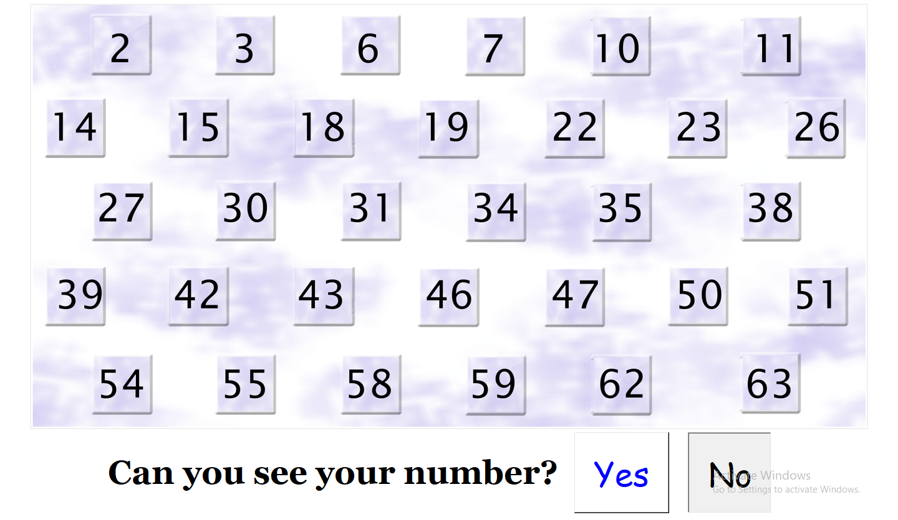
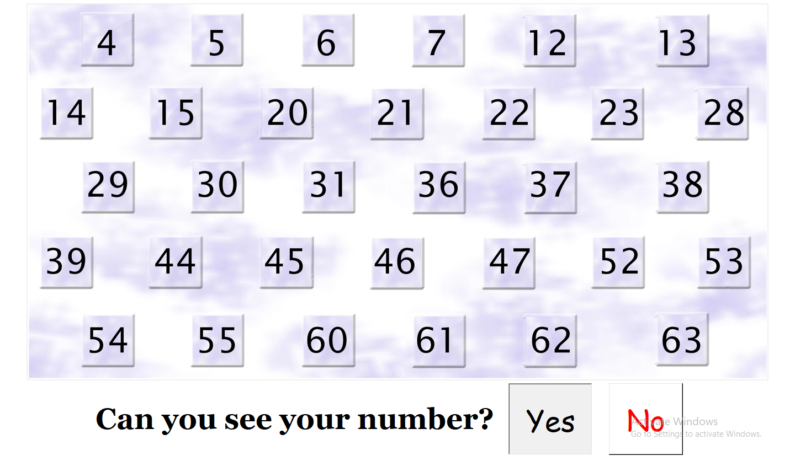
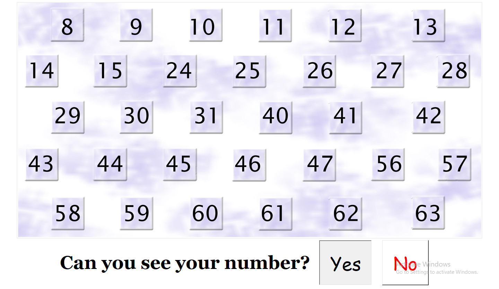
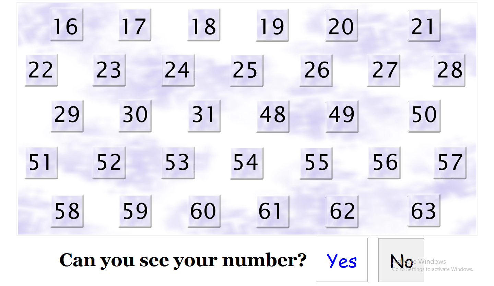
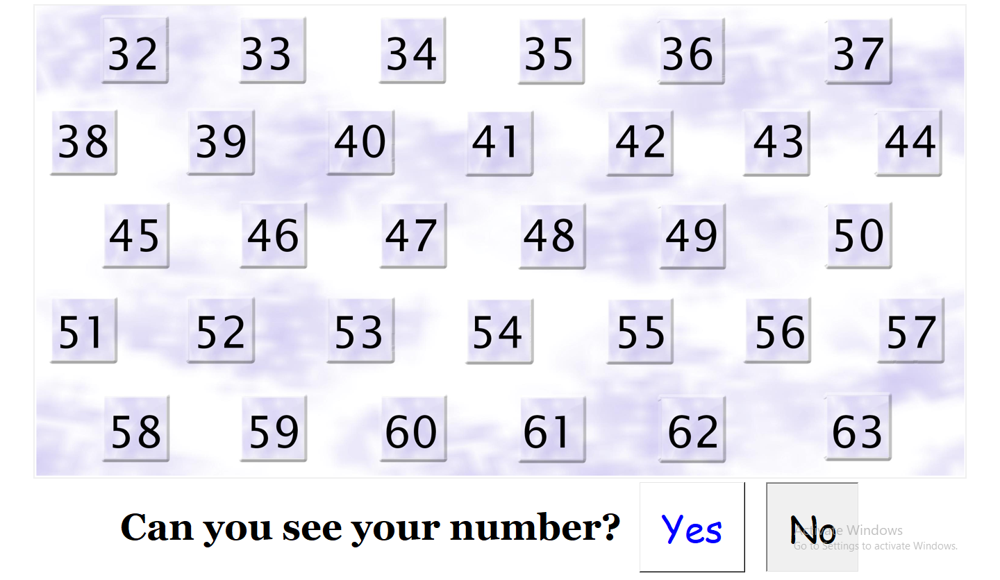
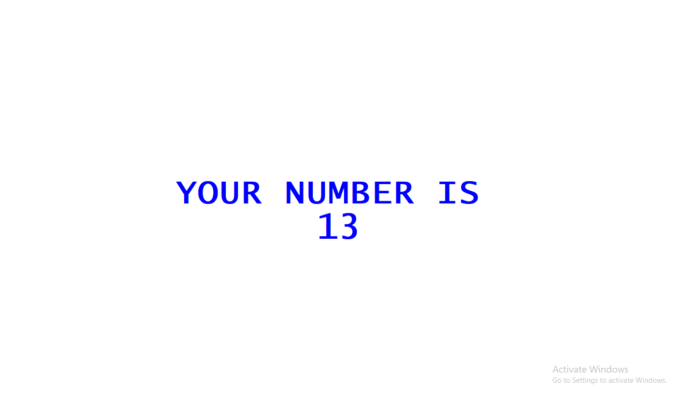

# Mind Reader

A fun and interactive mind-reading program built with the Tkinter module in Python. 

## Getting Started

### Prerequisites

- Python 3.x
- Tkinter
- Pillow

## How to Play

- Choose a number from 1 to 63.
- The program will display six cards with numbers on them.
- Indicate whether the number you selected earlier appears on each card.
- The program will reveal the number you originally chose.

-
-
-
-
-
-
-
-

## Authors

* **Syed Ashar Ali** -

## Support

If you like this project and would like to show your appreciation, consider supporting me on https://www.patreon.com/ashar2friends. Your support helps me continue to develop more projects. Thank you!
